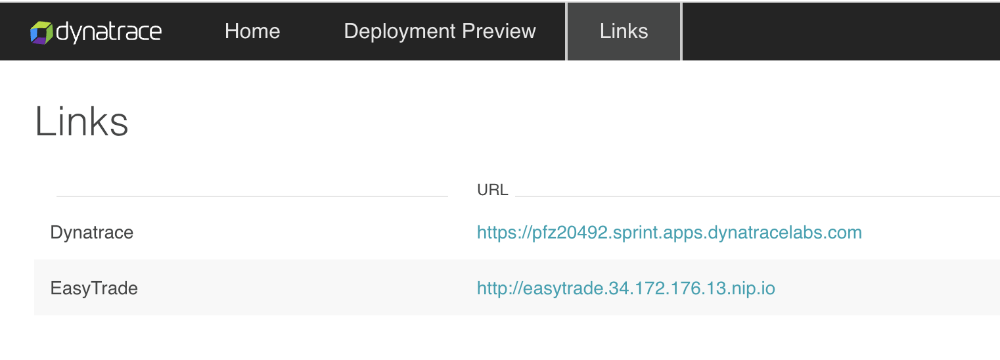
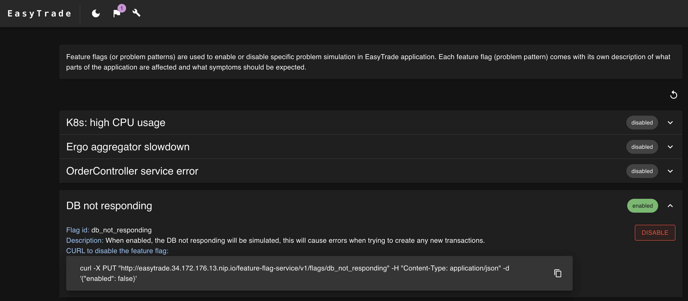
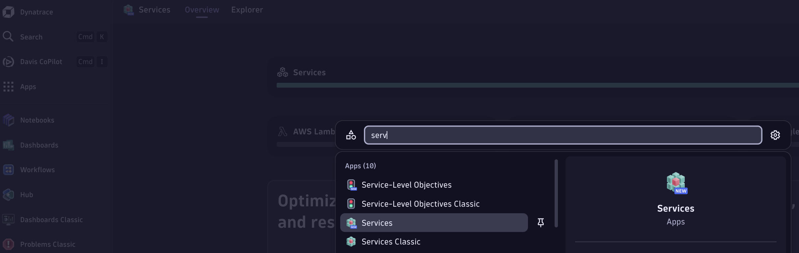
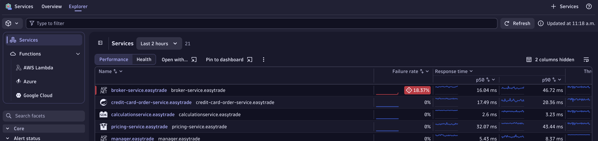
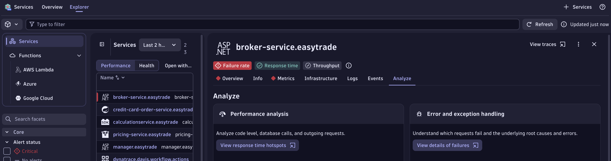
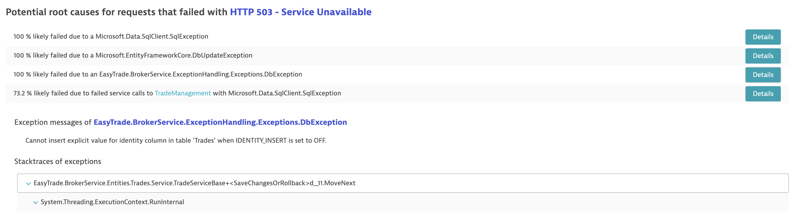

### Drill-down to service failure causes

Goal: we will intentionally break our EasyTrade app, and analyze the failure causes in Dynatrace

1. Within your ACE-Box, run the following command

```bash
kubectl get ingress -A
```

> Note: remember that you can access your ACE-Box instance like [this](../01_get-started/3_add_use_case.md#access-your-ace-box-instance)

2. Copy the dashboard URL and paste it in your browser, then click on Links:

```bash
dashboard.<IP_PLACEHOLDER>.nip.io
```



3. Open EasyTrade in your browser, click on the flag button at the top-left corner next, and enable the `DB not responding` feature-flag



4. Open your Dynatrace tenant, and go to the (New) Services app



5. Check for services with a high failure rate, in our case, `broker-service.easytrade`. Depending for how long you had the use case up and running, Dynatrace may open a problem or not. It depends for Davis to have enough datapoints to have a reliable source of data to actually open it.



6. Click on the `broker-service.easytrade`, go to the `Analyze` tab and click on `View details of failures`



7. Check the Easytrade service class and method throwing the exception, exception message and stacktrace



8. Scroll up to the top, and click on the traces button


9. Open a trace and analyze particularly that case


Well done, you manage to detect and understand the root cause of the failure. With the details of the exception, classes & methods, now you can fix the code.


